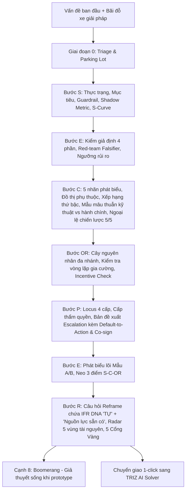

# Bản Đặc Tả Thiết Kế: AI SECOPER 3.0 Diagnostic Tool

- **Ngày tạo:** 17/08/2026
- **Dự án:** TRIZ Vietnam Web Platform
- **Tài liệu gốc:** `SECOPER_3.0_hoan_thien.docx`
- **Mục tiêu:** Xây dựng công cụ AI chẩn đoán bài toán chuyên sâu theo quy trình chuẩn hóa SECOPER 3.0, tích hợp DeepSeek API (Thinking/Reasoning mode), trực quan hóa dữ liệu chẩn đoán và chuyển giao trực tiếp sang công cụ TRIZ AI Solver.

---

## 1. Tổng Quan Kiến Trúc

Công cụ AI SECOPER 3.0 đóng vai trò là "Cỗ máy chẩn đoán và phát biểu đúng bài toán", kết nối trước khâu tìm giải pháp của TRIZ.



---

## 2. Hợp Đồng Dữ Liệu (TypeScript Interfaces)

Tạo mới và mở rộng các kiểu dữ liệu trong `src/types.ts`:

```typescript
export interface SecoperTriage {
  isQualified: boolean;
  triageReason: string;
  isJustDoIt: boolean;
  parkingLotSolutions: string[];
}

export interface SecoperSituation {
  situationStatement: string; // [Chỉ số] thay đổi từ [baseline] đến [hiện tại] trong [thời gian], ảnh hưởng [đối tượng]
  targetStatement: string; // [Chỉ số] đạt [target] trước [thời hạn]
  guardrailMetric: {
    name: string;
    threshold: string;
    rationale: string;
  };
  shadowMetric?: {
    name: string;
    rationale: string;
  };
  rawGap: string;
  sCurveSanityCheck: {
    status: 'OPTIMIZATION_ALLOWED' | 'S_CURVE_CEILING_REACHED';
    analysis: string;
    recommendation: string;
  };
  isProxyOrFermi: boolean;
}

export interface SecoperEvidenceItem {
  assumption: string;
  falsifier: string; // Soạn bởi Red-Team độc lập
  evidence: string;
  conclusion: 'TRUE' | 'FALSE' | 'INSUFFICIENT_DATA';
  riskLabel?: string; // [Giả định rủi ro cao — kiểm chứng bằng thực thi] nếu bypass ngưỡng chi phí
}

export interface SecoperEvidence {
  assumptions: SecoperEvidenceItem[];
  metricValidityConclusion: string;
  redTeamReviewSummary: string;
}

export interface SecoperCoreGapCandidate {
  id: string;
  text: string;
  label: 'Symptom' | 'Gap' | 'Contradiction' | 'Cause' | 'Consequence';
  impactScore?: number; // 1-5
  leverageScore?: number; // 1-5
  rank?: number;
  isStrategicBypass?: boolean; // Leverage = 5/5
  isAdministrativeContradictionRejected?: boolean;
}

export interface SecoperCoreGap {
  allCandidates: SecoperCoreGapCandidate[];
  validCandidates: SecoperCoreGapCandidate[];
  dependencyAnalysis: string;
  selectedCoreGap: {
    type: 'Gap' | 'Contradiction';
    statement: string;
    rationale: string;
  };
  parallelBranch?: {
    type: 'STRATEGIC_RESTRUCTURING' | 'INDEPENDENT_CORE_GAP';
    statement: string;
  };
}

export interface SecoperCauseNode {
  id: string;
  name: string;
  parentId?: string;
  impactScore?: number;
  directnessScore?: number;
  isLeaf?: boolean;
  isAlternativeBranch?: boolean;
}

export interface SecoperObstacle {
  causeTree: SecoperCauseNode[];
  leafCauses: {
    cause: string;
    impactScore: number;
    directnessScore: number;
  }[];
  selectedObstacle: string;
  impactRationale: string;
  reinforcingLoopCheck: {
    isReinforcingLoop: boolean;
    analysis: string;
    weakestLink?: string;
  };
  incentiveCheck: {
    hasVestedInterest: boolean;
    cobraEffectAnalysis: string;
    recommendation: string;
  };
}

export interface SecoperPerspective {
  locus: 'INDIVIDUAL' | 'DEPARTMENT' | 'SYSTEM' | 'MARKET';
  authorityLevelNeeded: string;
  keyDecisionMaker: string;
  decisionToChange: string;
  escalationCase?: {
    businessCaseSummary: string;
    defaultToActionNotice: string; // Hạn chót D-Day
    horizontalHandshakeCoSignDepartment?: string;
  };
  marketHandlingStrategy?: 'ESCALATE' | 'TURN_HARM_INTO_BENEFIT' | 'REDUCE_SCOPE_TO_SUB_SYSTEM';
}

export interface SecoperEssence {
  branchType: 'A_GAP' | 'B_CONTRADICTION';
  statement: string;
  anchorsCheck: {
    isCoreGapMatched: boolean;
    isObstacleMatched: boolean;
    isSituationMatched: boolean;
  };
}

export interface SecoperReframe {
  reframeQuestion: string; // Tích hợp 'TỰ' + 'nguồn lực sẵn có'
  resourceRadar: {
    emptySpace: string;
    idleTime: string;
    wasteInfo: string;
    physicalDifferential: string;
    turnHarmIntoBenefit: string;
  };
  fiveGoldenGates: {
    noImplicitSolution: boolean; // Gate 1 (đối chiếu Parking Lot)
    isMeasurable: boolean;       // Gate 2
    hasAuthority: boolean;       // Gate 3
    isUnambiguous: boolean;      // Gate 4
    areRealConstraints: boolean; // Gate 5 (lọc bỏ ràng buộc giả)
  };
  gateNotes: string[];
  livingHypothesisNotice: string;
}

export interface FullSecoperResult {
  triage: SecoperTriage;
  situation: SecoperSituation;
  evidence: SecoperEvidence;
  coreGap: SecoperCoreGap;
  obstacle: SecoperObstacle;
  perspective: SecoperPerspective;
  essence: SecoperEssence;
  reframe: SecoperReframe;
}
```

---

## 3. Backend Action (`src/actions/index.ts`)

- Khởi tạo Action `actions.solveSecoperProblem`:
  - Input:
    - `situation`: string (mô tả thô của người dùng).
    - `parkingLotSolutions`: string[] (giải pháp nghĩ sẵn trong đầu để niêm phong).
    - `lang`: `'vi' | 'en'`.
  - Logic:
    - Tích hợp System Prompt chuyên sâu nạp toàn bộ quy tắc SECOPER 3.0:
      - 5 van an toàn (Phụ lục B).
      - 5 cờ đỏ vĩ mô (Phụ lục C).
      - Cơ chế Red-team phản chứng cho Evidence.
      - Xếp hạng thứ bậc không cộng dồn (Impact $\rightarrow$ Leverage) cho Core Gap.
      - Chốt chặn vòng lặp gia cường & Incentive Check cho Root Obstacle.
      - Mặc định hành động & Bắt tay ngang cho Perspective.
      - Cài từ khóa IFR "TỰ" & Radar 5 vùng tài nguyên cho Reframe.
    - Gọi DeepSeek với `thinking: { type: 'enabled' }` và `reasoning_effort: 'high'`.
    - Trả về đối tượng JSON `FullSecoperResult`.

---

## 4. Giao Diện Người Dùng (`src/pages/[lang]/secoper.astro` & `src/components/SecoperClient.tsx`)

### Giao diện Chẩn đoán Tương tác SECOPER:
1. **Header Navigation**:
   - Thêm nút chuyển hướng "SECOPER AI" trong menu chính của `Header.astro`.
2. **Khu vực Nhập Liệu (Input Hero)**:
   - Ô nhập tình huống thực tế kèm các tình huống mẫu thực chiến.
   - Hộp mở rộng "Bãi đỗ xe giải pháp (Parking Lot)" để người dùng ghim các định kiến trước khi AI phân tích.
3. **Studio Dashboard Trực Quan**:
   - **Tab Giai đoạn 0**: Triage & Parking Lot Sealed Box.
   - **Tab S (Situation)**: Thẻ Thực trạng - Mục tiêu, Hộp Guardrail Metric (chống nệm nước), Shadow Metric (chống Goodhart), Đánh giá đường cong S.
   - **Tab E (Evidence)**: Bảng Red-Team Falsification với badge Đúng/Sai/Chưa rõ, cảnh báo ngưỡng rủi ro.
   - **Tab C (Core Gap)**: Phân loại 5 nhãn, bảng ma trận phụ thuộc, bảng xếp hạng thứ bậc (Impact vs Leverage), thẻ Tách nhánh tái cấu trúc hệ thống (nếu Leverage 5/5).
   - **Tab OR (Root Obstacle)**: Cây nguyên nhân trực quan phân nhánh, cảnh báo Vòng lặp gia cường và Báo cáo Incentive Check.
   - **Tab P (Perspective)**: Phân cấp 4 tầng Locus, Cấp thẩm quyền, Bản đề xuất Escalation với điều khoản Default-to-Action & D-Day.
   - **Tab E (Essence)**: Phát biểu lõi Mẫu A hoặc B kèm checklist đối soát 3 neo nhất quán.
   - **Tab R (Reframe)**: Khung câu hỏi định hình bài toán, Lưới Radar 5 vùng tài nguyên, Thẻ 5 Cổng Vàng (Five Golden Gates) và Cơ chế Boomerang.
4. **Tích hợp Chuyển Giao TRIZ**:
   - Nút **"Giải Bằng TRIZ AI Solver"**: Tự động chuyển trang `/[lang]/triz` và điền sẵn câu phát biểu bài toán chuẩn, kết nối mượt mà sang khâu tìm 40 nguyên lý sáng tạo.
5. **Xuất Báo Cáo**:
   - Nút **"Tải Báo Cáo PDF"** và **"Sao Chép Markdown"**.

---

## 5. Kế Hoạch Tự Đánh Giá & Xác Thực (Self-Review & Verification)

- [x] Không còn mục TBD / TODO.
- [x] Đảm bảo cấu trúc nhất quán giữa Type definition, Prompt JSON schema và UI rendering.
- [x] Đáp ứng đầy đủ quy trình nâng cấp 3.0 từ file docx.
- [x] Hỗ trợ song ngữ (Tiếng Việt & Tiếng Anh).
